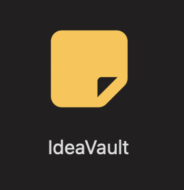
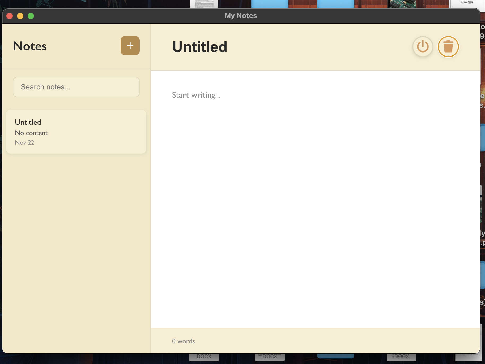

# 💡 IdeaVault — A Secure Note-Taking Desktop Application

Welcome to **IdeaVault**!  
IdeaVault is a simple, user-friendly desktop application designed for organizing school notes and securely storing personal information. While the first deployment is intended for personal use, future releases will support more users.

---

## ✨ Features

- **Secure Login** — Passwords are safely stored using bcrypt hashing to ensure privacy.
- **Note-Taking** — Create and organize notes for classes, projects, or personal use.
- **Remote Database** — All data is stored in a remote PostgreSQL database for reliability and security.

---

## 🛠️ Technologies Used

- **Electron.js** — Framework for building cross-platform desktop apps using HTML, CSS, and JavaScript. (*Font Awesome is used for icon selection.*)
- **PostgreSQL** — Open-source relational database for secure data storage.
- **bcrypt.js** — Used for password hashing and authentication security.

---

## 🔍 Preview

To view the first release:

1. Go to the **Releases** section.
2. Select **v1.0.0**
3. Download **dist.zip**

Inside `dist.zip`, open the `mac-arm64` folder to access the application.

### Application icon

  

### Login page

  

### Incorrect password

  

Once the username and password match the hashed credentials stored in the PostgreSQL database, access to the main page is granted:

### Main page

  

From here, notes can be added, deleted, saved, and safely exited using the toolbar buttons.

### Example usage

  

---

## 🚀 Future Plans

This is the first release of IdeaVault and currently supports only a private user.  
Future releases will introduce support for multiple users and scalable authentication using a remote database solution such as **Supabase**.

---
