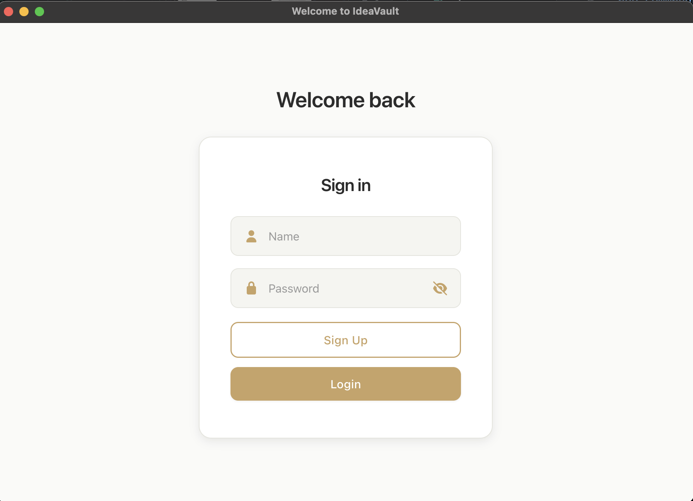
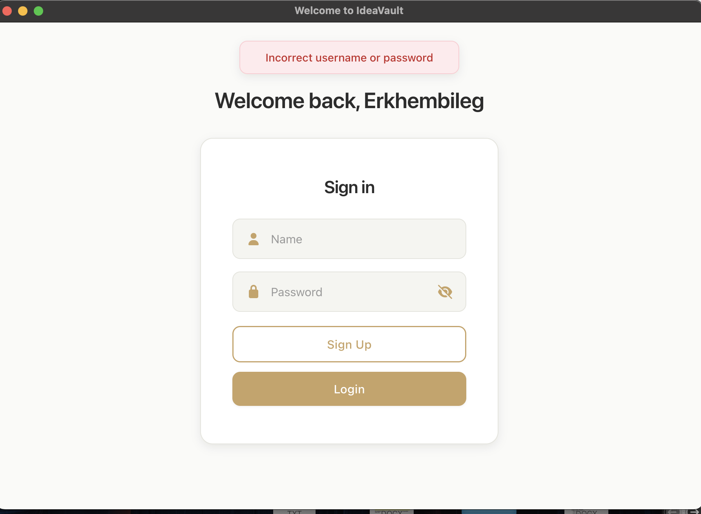
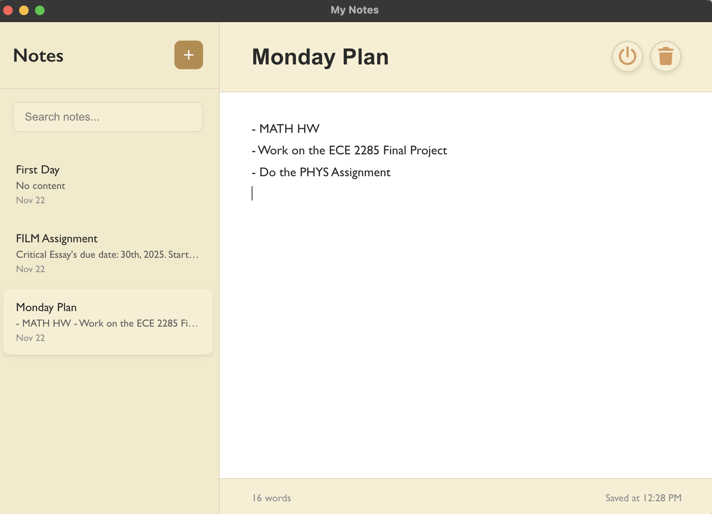

# 💡 IdeaVault

Welcome to **IdeaVault v1.0.0**!  
---
A simple desktop app for organizing notes and securely storing personal information. Future versions will support multiple users.

## ✨ Features

- **Secure Login** with bcrypt password hashing
- **Auto-Save** to prevent data loss
- **Remote Database** (PostgreSQL)
- **Cross-Platform** (macOS, Windows, Linux)

---

## 🛠️ Tech Stack

Electron.js • PostgreSQL • bcrypt.js • Node.js

---

## 📦 Installation

**Requirements:** macOS (ARM64), Internet connection

1. Download **v1.0.0** from [Releases](https://github.com/Lumb3/IdeaVault/releases/tag/v1.0.0)
2. Extract `IdeaVault.zip` and open the `mac-arm64` folder
3. Double-click **IdeaVault** to launch

> **macOS Note:** First-time users may need to right-click → "Open" to bypass Gatekeeper.

---

## 🚀 Quick Start

1. Launch the app and login with provided credentials
2. Click "+" to create notes
3. Save with Cmd+S or the save button
4. Always use the exit button to ensure data is saved

---

## 🔍 Preview

   
  
  

---

## 🚀 Planned Features

- Multi-user support with Supabase authentication
- Note tagging and search functionality
- Mobile companion app
- Dark mode
- Export to PDF/Markdown
- Reminders and notifications

---

## 📝 License

MIT License - see [LICENSE](LICENSE) for details.

---

Made with ❤️ by Lumb333

  <a href="https://github.com/Lumb3/IdeaVault">⭐ Star this repository!</a>

