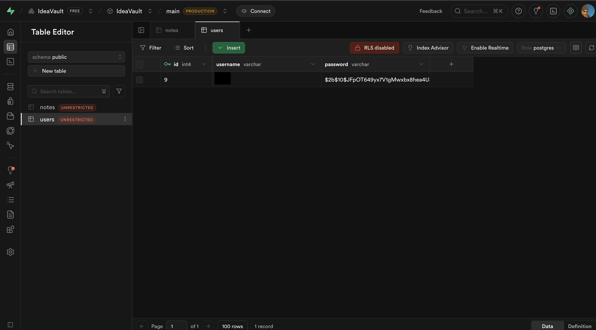

# IdeaVault

## Welcome to **IdeaVault v3.0.0** (Beta)

**IdeaVault** is a simple desktop application for organizing notes and securely storing personal information. Future versions will support multiple users and expanded features.

---

## Features

- **Secure Login** with bcrypt password hashing
- **Auto-Save** to prevent data loss
- **Remote Database** (PostgreSQL)
- **Cross-Platform** (macOS, Windows, Linux)

---

## Tech Stack

Electron.js • Node.js • PostgreSQL • Supabase • bcrypt.js

---

## Installation

**Requirements:** macOS (ARM64), Internet connection

1. Download **v3.0.0** from [Releases](https://github.com/Lumb3/IdeaVault/releases/tag/second_release)
2. Extract `IdeaVault.zip` and open the `mac-arm64` folder
3. Double-click **IdeaVault** to launch

> **macOS Gatekeeper Note:**
> If macOS blocks the app on first launch, right-click the app → **Open**.
> Need help? [Watch this video](https://www.youtube.com/watch?v=_M9RKS_i11I).

---

## How to use?

1. Launch the app and log in using the provided credentials
2. Click **+** to create a new note
3. Select a note and format it using **bold**, *italic*, <u>underline</u>, or the highlighter
4. Click the **🎤 microphone** button to convert speech to text
5. Use the **Exit** button to ensure all data is saved properly

---

## Backend Overview

The backend consists of two main tables:

* **Users**: Stores usernames and bcrypt-hashed passwords
* **Notes**: Stores user-created notes securely in the database

All data is managed via **Supabase** with a PostgreSQL backend.

<p align="center">
  
</p>

---

## Preview

<p align="center">
  
  
  
  
  
  
  
</p>

---

## Contributing Guidelines

1. Fork the repository
2. Create a feature branch

   ```bash
   git checkout -b feature/your-feature-name
   ```
3. Commit your changes

   ```bash
   git commit -m "Add your message here"
   ```
4. Push the branch

   ```bash
   git push origin feature/your-feature-name
   ```
5. Open a Pull Request

---

## Planned Features

- Multi-user support with Supabase authentication
- Note tagging and search functionality
- Mobile companion app
- Dark mode
- Export to PDF/Markdown
- Reminders and notifications

---

## License

This project is licensed under the **MIT License**.
See the [LICENSE](LICENSE) file for more details.

---

<p align="center">
  Made by <a href="https://github.com/Lumb3">Lumb333</a>
</p>
<p align="center">
  Pentested by <a href="https://github.com/Zwique">Zwique</a>
</p>
<p align="center">
  <a href="https://github.com/Lumb3/IdeaVault">⭐ Star this repository!</a>
</p>

---