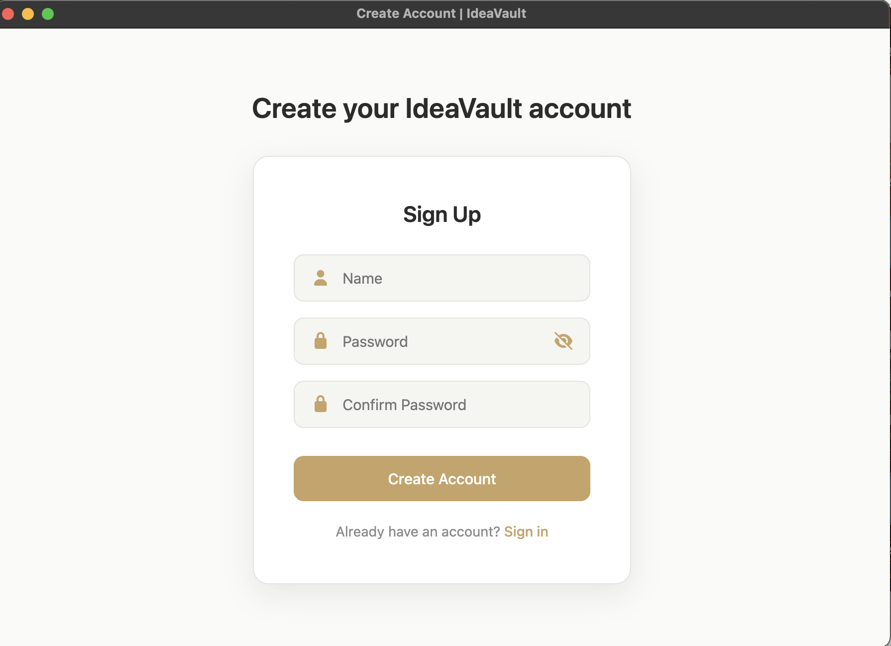
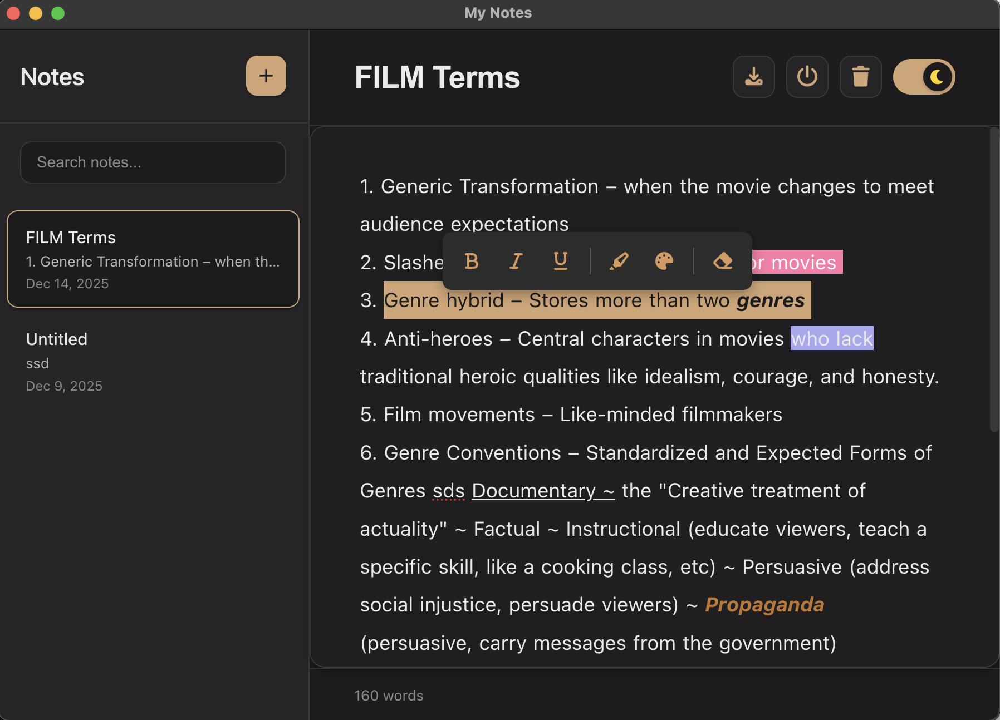
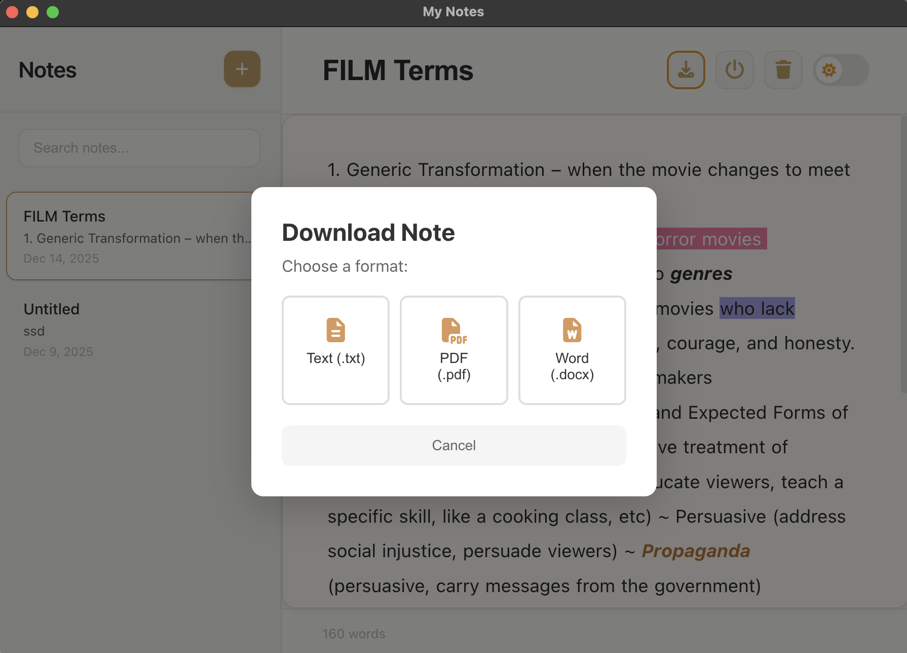

# IdeaVault

## Welcome to **IdeaVault v3.0.0** Beta Test!

A simple desktop app for organizing notes and securely storing personal information. Future versions will support multiple users.

## Features

- **Secure Login** with bcrypt password hashing
- **Auto-Save** to prevent data loss
- **Remote Database** (PostgreSQL)
- **Cross-Platform** (macOS, Windows, Linux)

---

## Tech Stack

Electron.js • PostgreSQL • bcrypt.js • Node.js

---

## 📦 Installation

**Requirements:** macOS (ARM64), Internet connection

1. Download **v3.0.0** from [Releases](https://github.com/Lumb3/IdeaVault/releases/tag/second_release)
2. Extract `IdeaVault.zip` and open the `mac-arm64` folder
3. Double-click **IdeaVault** to launch

> **macOS Note:** First-time users may need to right-click → "Open" to bypass Gatekeeper. <a href="https://www.youtube.com/watch?v=_M9RKS_i11I">Check this video out!</a>

---

## Quick Start

1. Launch the app and log in using the provided credentials
2. Click **+** to create a new note
3. Select a note to format it with **bold**, _italic_, <u>underline</u>, or highlighter
4. Click the **mic** button to start converting your speech to text
5. Use the **Exit** button to ensure your data is saved properly

---

## Preview

   
  
  
  
  
  
  

---

## Contributing Guidelines

1. Fork the project
2. Create a feature branch (`git checkout -b ...`)
3. Commit your changes (`git commit -m "..."`)
4. Push to the branch (`git push origin ...`)
5. Open a pull request

## Planned Features

- Multi-user support with Supabase authentication
- Note tagging and search functionality
- Mobile companion app
- Dark mode
- Export to PDF/Markdown
- Reminders and notifications

---

## License

MIT License - see [LICENSE](LICENSE) for details.

---

Made by <a href="http://github.com/Lumb3">Lumb333</a>

Pentested by <a href="https://github.com/Zwique">Zwique</a>

  <a href="https://github.com/Lumb3/IdeaVault">⭐ Star this repository!</a>

